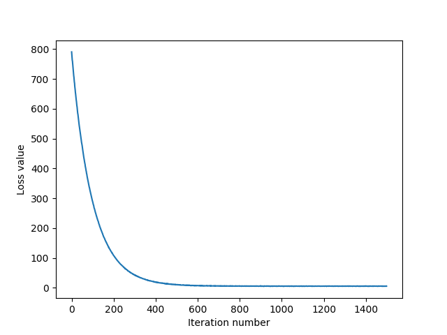

# My solutions to CS231n assignments (done on local setup)

## Progress

- [x] Assignment 1
  - [x] k-Nearest Neighbor classifier
  - [x] Training a Support Vector Machine
  - [x] Implement a Softmax classifier
  - [x] Two-Layer Neural Network
  - [-] High Level Representations: Image Features (Optional)
- [] Assignment 2
  - [] Multi-layer Fully Connected Neural Networks
  - [] Batch Normalization
  - [] Dropout
  - [] Convolutional Neural Networks
  - [] PyTorch on Cifar-10
- [] Assignment 3

## Results

* k-Nearest Neighbor cross-validation

* SVM training loss

* SVM trained weights visualization

* Softmax trained weights visualization

* Two layer net loss and accuracy without hyperparameter tuning

* Two layer net weights visualization without hyperparameter tuning

* Two layer net tuned loss and accuracy

* Two layer net tuned weights visualization

